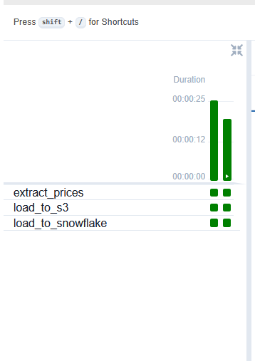
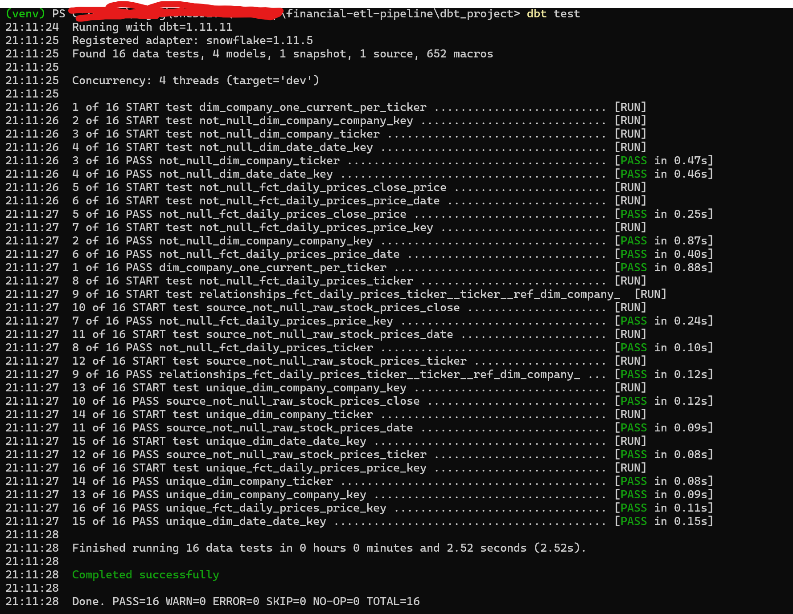

# Financial ETL Pipeline — S&P 500 Daily Prices

End-to-end data engineering pipeline that ingests 5 years of daily OHLCV data for the entire S&P 500 from yfinance, loads it into AWS S3, lands it in Snowflake via secure key-pair auth + storage integration, and transforms it into a dimensional model with dbt — orchestrated by Apache Airflow.

**Stack:** Python • Apache Airflow • AWS S3 • Snowflake • dbt • Docker

## Architecture

yfinance API
│
│  (Python extract, batch download via threads)
▼
Local Parquet (partitioned by date)
│
│  (boto3 upload)
▼
AWS S3  s3://<bucket>/raw/stock_prices/date=YYYY-MM-DD/prices.parquet
│
│  (Snowflake Storage Integration + COPY INTO)
▼
Snowflake RAW.STOCK_PRICES  (immutable landing zone)
│
│  (dbt transformations + tests)
▼
Snowflake ANALYTICS layer:
 stg_stock_prices    (view, deduped + typed)
 dim_company         (SCD Type 2)
 dim_date            (calendar dimension)
 fct_daily_prices    (star schema fact)

 Orchestrated by Airflow on a `0 22 * * 1-5` schedule (10pm UTC weekdays, after US market close).

## Data scale

| Layer | Rows | Notes |
|---|---|---|
| Raw landing | ~625K per snapshot | 503 S&P 500 tickers × 5 years |
| Staging (deduped) | ~625K | After dedup of overlapping snapshots |
| Fact table | ~625K | Grain: one row per ticker per trading day |
| Date dimension | 4,017 | 2020-01-01 through 2030-12-31 |
| Company dimension | 504 | SCD Type 2, tracks sector history |

## Highlights

- **Idempotent loads** — Snowflake COPY INTO with file-level load history prevents duplicate ingestion
- **Secure auth** — RSA key-pair authentication to Snowflake (no passwords stored)
- **Storage integration** — Snowflake assumes a scoped IAM role to read from S3 (no AWS keys stored in Snowflake)
- **Data quality** — 16 automated dbt tests covering uniqueness, not-null, and referential integrity
- **SCD Type 2** — Company sector changes tracked over time via dbt snapshots, enabling point-in-time analysis
- **Surrogate keys** — All dimension/fact keys are hashed surrogates (production best practice)
- **Cluster keys** — `fct_daily_prices` clustered by `(price_date, ticker)` for fast slice queries

## Screenshots

### Airflow DAG
End-to-end pipeline orchestration with three sequential tasks:



### Data quality tests
All 16 dbt tests passing — uniqueness, not-null, referential integrity, and SCD2 invariants:


## Project structure


financial-etl-pipeline/
├── dags/                          # Airflow DAG definitions
├── src/                           # Python ETL tasks
│   ├── extract.py                 # yfinance → parquet
│   ├── load_s3.py                 # parquet → S3
│   └── load_snowflake.py          # S3 → Snowflake (COPY INTO)
├── dbt_project/                   # dbt transformations
│   ├── models/
│   │   ├── staging/
│   │   │   └── stg_stock_prices.sql
│   │   └── marts/
│   │       ├── dim_company.sql
│   │       ├── dim_date.sql
│   │       └── fct_daily_prices.sql
│   ├── snapshots/
│   │   └── dim_company_snapshot.sql  # SCD2
│   └── tests/                     # Custom data quality tests
├── sql/
│   └── snowflake_setup.sql        # One-time DDL
├── docs/
│   ├── data_dictionary.md
│   └── source_to_target_mapping.md
├── docker-compose.yaml            # Airflow stack
└── README.md


## How it runs

The Airflow DAG `financial_etl_pipeline` chains three tasks:

1. **`extract_prices`** — Scrapes the current S&P 500 ticker list from Wikipedia, downloads 5 years of daily OHLCV from yfinance, writes a partitioned parquet file.
2. **`load_to_s3`** — Uploads the latest partition to S3 under `raw/stock_prices/date=YYYY-MM-DD/`.
3. **`load_to_snowflake`** — Runs `COPY INTO RAW.STOCK_PRICES` from the S3 stage. Idempotent via Snowflake's load history.

dbt models are run separately (or via a future Airflow task) to transform raw → staging → marts.

## Example analytical query

```sql
SELECT
    c.sector,
    f.ticker,
    AVG(f.daily_pct_change) AS avg_daily_return,
    STDDEV(f.daily_pct_change) AS volatility,
    COUNT(*) AS trading_days
FROM FINANCIAL_ETL.ANALYTICS_ANALYTICS.FCT_DAILY_PRICES f
JOIN FINANCIAL_ETL.ANALYTICS_ANALYTICS.DIM_COMPANY c
    ON f.ticker = c.ticker
    AND f.price_date >= c.valid_from
    AND f.price_date < c.valid_to
WHERE f.price_date >= '2025-01-01'
GROUP BY c.sector, f.ticker
ORDER BY volatility DESC
LIMIT 10;
```

This uses the SCD2 point-in-time join — each price row joins to the sector that was in effect on that trading day.

## Local setup (for reproducibility)

> Note: requires AWS + Snowflake accounts. See `docs/setup.md` for full credential setup. This README assumes those exist.

```bash
# 1. Python dependencies
python -m venv venv
source venv/bin/activate           # On Windows: .\venv\Scripts\Activate.ps1
pip install -r requirements.txt

# 2. Configure secrets
cp .env.example .env                # Then fill in real values

# 3. Run the Snowflake DDL (one time)
# Paste sql/snowflake_setup.sql into a Snowflake worksheet

# 4. Run the Python pipeline manually
python src/extract.py
python src/load_s3.py
python src/load_snowflake.py

# 5. Or run via Airflow
docker compose up -d
# Visit http://localhost:8080 (admin/admin)

# 6. Run dbt transformations
cd dbt_project
dbt deps
dbt snapshot
dbt run
dbt test
```

## Known limitations / production gaps

Honest about what this is *not*:

- **Sector classification is hardcoded** for ~50 tickers; everything else is "Other". A production pipeline would join to an enrichment API (FMP, Polygon, IEX Cloud).
- **No alerting** on pipeline failures beyond Airflow's email config (not enabled here).
- **dbt runs are manual** — would normally be triggered by a downstream Airflow task with `BashOperator` or via Astronomer Cosmos.
- **`FORCE=TRUE` is used on initial loads** to handle re-ingestion. A real incremental pipeline would use `MERGE` keyed on `(ticker, date)` instead.
- **No CI/CD** — would use GitHub Actions to run `dbt build` and `pytest` on every PR.

## Technologies used (and why)

| Tool | Why |
|---|---|
| **Python** | Universal glue for ETL; pandas/pyarrow for in-memory transforms |
| **yfinance** | Free, reliable source of public market data |
| **AWS S3** | Cheap, durable, infinitely scalable storage; standard data lake foundation |
| **Snowflake** | Separates storage from compute; auto-scales; SQL-native |
| **dbt** | SQL-first transformations with built-in testing, documentation, lineage |
| **Apache Airflow** | Industry-standard scheduler; DAGs as code; rich UI |
| **Docker Compose** | Reproducible local Airflow stack with one command |
